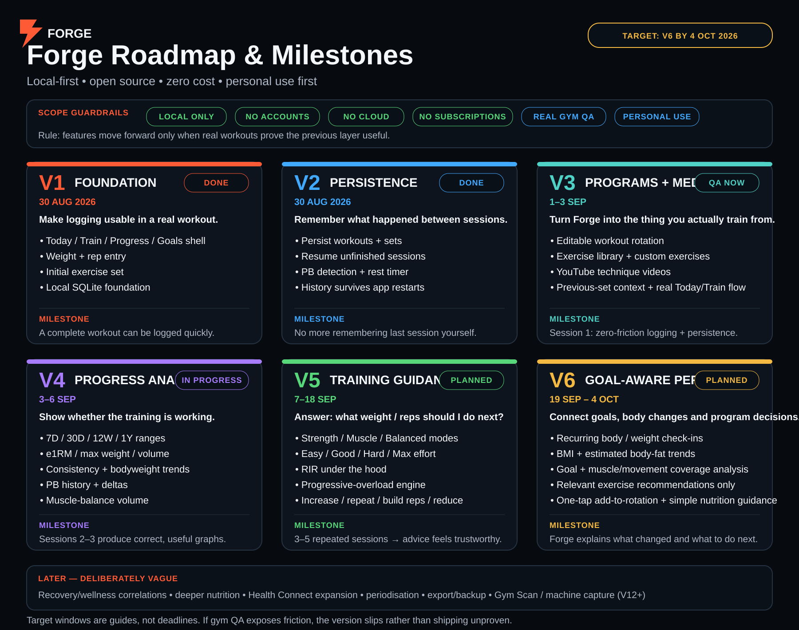

# Forge Fitness

A private, Android-first fitness tracker built for personal use: workouts, strength progression, body weight, goals, PBs, and eventually Health Connect steps.

## MVP status

The first product slice includes:

- **Today** — dashboard, weight logging, weekly consistency, today's workout, latest PB
- **Train** — structured Push Strength workout with previous-set context
- **Exercise detail** — editable kg/reps, set completion, add-set interaction, technique placeholder
- **Progress** — persisted weight trend, strength progress, PB summary
- **Goals** — persisted benchmark list and completion state
- **Local persistence** — SQLite schema for weights, goals, workouts, sets, exercises and PBs

The app ships with seed data so the first-run UI is useful immediately. The step count shown in this first slice is explicitly preview data; Android Health Connect will replace it in the next implementation pass.

## Product principles

1. Fitness first; mental-health features stay out of the core training flow and nutrition stays lightweight until training guidance is proven.
2. No account, subscription, analytics SDK, or remote backend required.
3. Personal data stays on-device by default.
4. One-handed workout logging and obvious previous-set context.
5. Premium visual quality despite being a private app.
6. Science underneath, plain-English guidance on top.
7. Outcomes over catalogue size: surface only exercises and recommendations that matter for the current goal.
8. Real gym use is the merge gate. If a feature adds friction, fix it before expanding scope.

## Roadmap



The roadmap is intentionally **milestone-led rather than deadline-led**. Target windows are guides for sequencing; physical-device and real-workout QA wins over an arbitrary release date.

| Version | Focus | Status / target | Real-world gate |
| --- | --- | --- | --- |
| **V1 — Foundation** | Fast workout logging and local data foundation | ✅ Completed 30 Aug 2026 | A complete workout can be logged quickly. |
| **V2 — Persistence** | Persisted workout sessions, sets, PBs, resume flow and rest timer | ✅ Merged 30 Aug 2026 | Forge remembers the session so the user does not have to. |
| **V3 — Programs + Media** | Editable rotation, broader exercise library, previous-set context and YouTube technique media | 🧪 QA target 1–3 Sep | Session 1 proves logging, persistence, rotation and exercise media are low-friction in the gym. |
| **V4 — Progress Analytics** | Real graphs and insights: consistency, e1RM, max weight, volume, bodyweight, PB deltas and muscle balance | 🧪 Target 3–6 Sep | Sessions 2–3 produce correct numbers and graphs that are actually useful. |
| **V5 — Training Guidance** | Strength/Muscle/Balanced focus, simple RIR capture and conservative progressive-overload recommendations | 🎯 Target 7–18 Sep | 3–5 repeated exercise sessions produce recommendations that feel sensible, explainable and safe to override. |
| **V6 — Goal-aware Personalisation** | Recurring progress check-ins, body-composition trends, goal/muscle coverage analysis, relevant exercise recommendations and one-tap program updates | 🎯 Target 19 Sep–4 Oct | Forge can explain what changed, what it means, and what to do next toward the current physique/performance goal. |

### Immediate QA sequence

1. **Session 1:** train normally. Judge workout logging friction first — weights, reps, sets, navigation, previous context, videos and persistence.
2. **Session 2:** repeat normal training and validate that history, graphs, calculations and numbers reflect reality.
3. **Sessions 3–5+:** accumulate enough repeated-exercise history for V5 progressive-overload guidance to become meaningful rather than speculative.
4. Record every moment where the user hesitates, gets confused, has to remember something Forge should know, or finds Forge slower than simply training without it.

### V5 north-star question

> Based on what I have actually lifted recently, what weight and rep target should I attempt today — and why?

Forge should hide jargon where possible while still using evidence-based calculations such as e1RM, training volume and RIR underneath. Recommendations are guidance, never mandatory overrides.

### V6 north-star loop

**Goal → program → workouts → measurements → analysis → recommendation → revised program**

V6 should begin connecting strength progress to regular weigh-ins/body measurements and stated goals such as building overall muscle, getting leaner while preserving muscle, increasing shoulder/arm/chest development, or building a stronger V-taper. A large exercise catalogue may exist under the hood, but Forge should only surface exercises that solve a current program gap or offer a useful substitution.

### Later — deliberately vague

These ideas stay parked until the V1–V6 core has earned them through real use:

- recovery and wellness correlations (sleep, sauna, cold exposure, activity)
- deeper nutrition tracking and recommendations
- broader Health Connect integrations
- smarter periodisation / longer-term forecasting
- local export and backup tools
- **Gym Scan / machine photo capture around V12+** — recognise available gym equipment and build an equipment inventory after the recommendation engine is already proven
- accounts, cloud hosting, subscriptions, public onboarding, social/community and commercialisation are **out of scope for now**

## Stack

- Expo SDK 57 / React Native 0.86
- TypeScript
- Expo Router
- Expo SQLite
- Material Community Icons
- Expo Haptics
- Expo Development Client / EAS Build for Android testing

## Test on a physical Android device

Forge does not need Vercel or the Google Play Store. The recommended workflow is an Expo development build installed directly on the Android device.

### First-time computer setup

```bash
git clone https://github.com/mindfree1/forge-fitness.git
cd forge-fitness
git checkout feature/training-core-v2
npm install
npm install --global eas-cli
eas login
```

On the first EAS build, Expo may ask to create/link an EAS project and generate Android signing credentials. Accept the managed defaults for this personal app.

### Development APK — recommended while building

```bash
eas build --platform android --profile development
```

Open the build URL on the Android device and install the generated APK. Android may ask you to allow installs from the browser or Files app used to open the APK.

After Forge is installed, start the development server on the computer:

```bash
npm run dev
```

Open Forge from the Android home screen and connect to the development server. The phone and computer can use the same Wi-Fi network. If local-network discovery is troublesome, run:

```bash
npx expo start --dev-client --tunnel
```

JavaScript/TypeScript changes normally appear without rebuilding the APK. Rebuild the development client when adding or changing native libraries/configuration, including Health Connect integration.

### Standalone preview APK — use without a computer

```bash
eas build --platform android --profile preview
```

Install the resulting APK from the Expo build link. This build contains the JavaScript bundle and can be used normally without Metro or a development computer running.

### Optional local USB workflow

With Android Studio/Android SDK and USB debugging configured, Forge can also be compiled and installed directly from the computer:

```bash
npx expo run:android
```

For this project, EAS development + preview APKs are the recommended default because they require less Android build-tool maintenance.

## Build profiles

`eas.json` contains:

- `development` — installable APK with Expo Dev Client and debugging tools
- `preview` — installable standalone APK for real-world testing
- `production` — reserved for a future store-style build if ever needed

## Current implementation lineage

- `main` — V2 training core merged
- `feature/training-programs-v3` — V3 editable programs, exercise library/media and real progress surfaces; draft PR #2 pending device QA
- `feature/progress-v4` — V4 analytics implementation; draft PR #3 pending physical-device visual/gym QA
- `feature/training-guidance-v5` — V5 progressive-overload / RIR specification; draft PR #4, implementation follows stable V4

## Data model

SQLite currently creates and evolves local tables for:

- `weight_entries`
- `goals`
- `workouts`
- `exercises`
- `workout_sets`
- `personal_bests`
- plus additive program/template structures on the V3 lineage

This keeps the app local-first while leaving room for future Health Connect, lightweight nutrition guidance and optional local backup/export without requiring accounts or cloud infrastructure.
